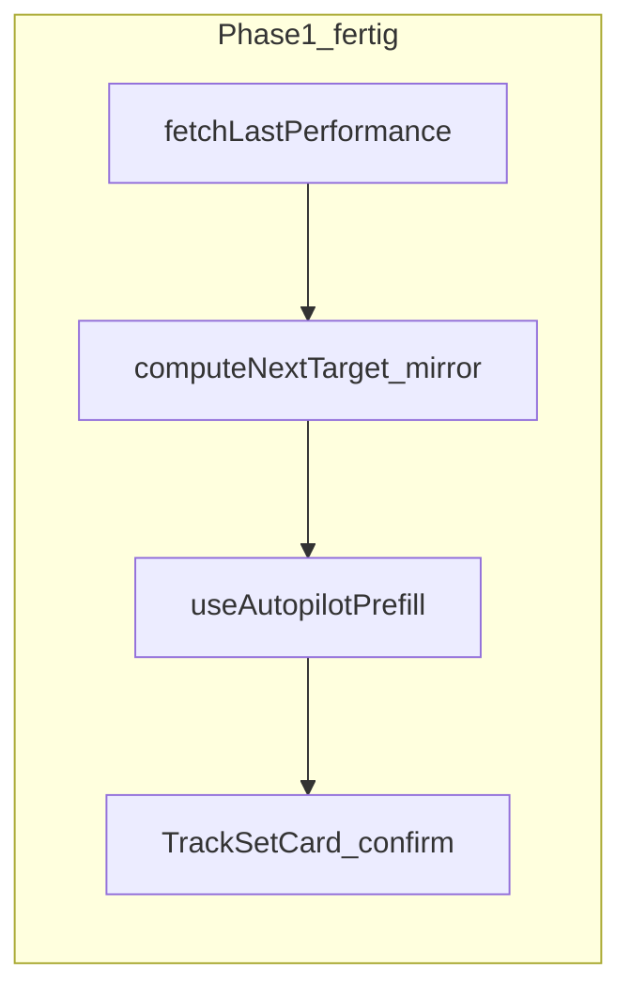
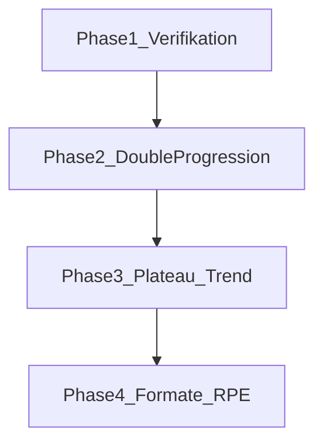

# Auto-Pilot: Implementierungs-Roadmap (Phase 1–4)

## Ausgangslage

**Phase 1 ist bereits umgesetzt** — laut [`.agents/memory/current.md`](.agents/memory/current.md) und Code:

| Baustein | Datei | Status |
|---|---|---|
| Pure Engine (Mirror, kein +kg) | [`src/lib/progressionEngine.ts`](src/lib/progressionEngine.ts) | ✅ |
| Engine-Tests | [`src/lib/progressionEngine.test.ts`](src/lib/progressionEngine.test.ts) | ✅ |
| `fetchLastPerformance` | [`src/lib/db.ts`](src/lib/db.ts) (~Z.1497) | ✅ |
| Pre-Fill-Hook | [`src/lib/useAutopilotPrefill.ts`](src/lib/useAutopilotPrefill.ts) | ✅ |
| TrackScreen-Anbindung | [`src/screens/TrackScreen.tsx`](src/screens/TrackScreen.tsx) | ✅ |
| ✓-Confirm + Override UI | [`src/components/track/TrackSetCard.tsx`](src/components/track/TrackSetCard.tsx) | ✅ |
| `suggested`-Flag (nicht persistiert) | [`src/lib/engine.ts`](src/lib/engine.ts), `setsForPersistence` in TrackScreen/PhoneApp | ✅ |



---

## Phase 1 — Verifikation (vor Phase 2)

Manueller E2E-Check, bevor echte Progression Vertrauen kostet:

1. **Session A:** Plan-Workout mit `straight_sets` × `weight_reps` tracken, Sätze manuell ausfüllen und speichern.
2. **Session B:** Gleiche Übung erneut starten → Sätze sind vorbefüllt (gedämpft, `suggested: true`), Hint „Letzte Session: …" auf Satz 1.
3. **One-Tap:** ✓ bestätigt ohne Tippen → `done: true`, `suggested` verschwindet.
4. **Override:** Wert ändern → gespeicherter Wert fließt in nächste Session ein (nicht der Vorschlag).
5. **Persistenz:** Gespeicherte `session_exercises.sets` enthalten kein `suggested`-Feld.
6. **Edge Cases:** Erste Session ohne Historie → Plan-Defaults; freie Übung ohne `catalog_exercise_id` → Name-Match; Supersatz-Block → gleiches Verhalten.

Optional ergänzen: 1–2 Vitest-Tests für `fetchLastPerformance`-Filterlogik (Mock oder Test-Fixtures), da DB-Layer aktuell ungetestet ist.

---

## Phase 2 — Echte Progression (Double Progression + Badge)

**Ziel:** Engine steigert Last/Reps konservativ; UI macht Steigerung sichtbar („+2,5 kg").

### 2.1 Engine erweitern — [`src/lib/progressionEngine.ts`](src/lib/progressionEngine.ts)

**Neue Inputs in `ComputeNextTargetInput`:**
- `targetRepsMin` / `targetRepsMax` — Rep-Spanne für Double Progression
- `weightIncrementKg` — aus Preferences oder Muskelgruppe
- optional `muscleGroup` — für pauschale +2,5 kg (Oberkörper) vs. +5 kg (Unterkörper)

**Rep-Spanne (MVP-Heuristik, kein DB-Schema nötig):**
- `targetRepsMax` = max. Reps aus Plan-Sätzen (Working Sets)
- `targetRepsMin` = max(1, targetRepsMax − 2) — konservativ, wie im Design-Doc „später konfigurierbar"

**Double-Progression-Logik** (nur `straight_sets` / `superset` × `weight_reps`):

```
Alle Working-Sets der letzten Session ≥ targetRepsMax?
  → ja: kg += weightIncrementKg, reps = targetRepsMin (Warm-up unverändert spiegeln)
  → nein: kg halten, reps = min(lastReps + 1, targetRepsMax) pro Satz
```

**`SetSuggestion` erweitern:**
- `source`: `"last_session" | "plan_default" | "progression"`
- `progressionNote?: string` — z. B. `"+2,5 kg"`, `"Reps +1"`

**Neue Hilfsfunktionen:**
- `resolveWeightIncrement(muscleGroup?, prefs)` — Default +2,5 kg; Beine/Rücken +5 kg
- `roundToKgStep(kg)` — an [`KG_STEP = 1.25`](src/lib/exerciseSets.ts) ausrichten

**Tests:** Mindestens 6 neue Cases in [`progressionEngine.test.ts`](src/lib/progressionEngine.test.ts):
- Alle Sätze am Rep-Maximum → +kg, Reps zurück
- Noch unter Maximum → +1 Rep, kg gleich
- Warm-up-Satz wird nicht progressiert
- Superset-Format gleiche Logik
- Inkrement 2,5 vs. 5 kg nach Muskelgruppe
- Keine Steigerung bei unvollständiger letzter Session

### 2.2 Preferences — [`src/lib/preferences.ts`](src/lib/preferences.ts)

Neues optionales Feld in `UserPreferences`:

- `weightIncrementUpperKg: number` (Default 2.5)
- `weightIncrementLowerKg: number` (Default 5)

Normalisierung + Persistenz in `profiles.preferences` JSONB. Settings-UI minimal: zwei Stepper unter Trainings-Defaults (später erweiterbar).

### 2.3 Hook + UI

**[`useAutopilotPrefill.ts`](src/lib/useAutopilotPrefill.ts):**
- Preferences + Muskelgruppe (aus `catalog_exercise_id` → exercises-Tabelle oder Exercise-Objekt) an `computeNextTarget` durchreichen
- `ExercisePrefillResult` um `progressionNote?: string` erweitern

**[`TrackSetCard.tsx`](src/components/track/TrackSetCard.tsx) / [`TrackExerciseSlide.tsx`](src/components/track/TrackExerciseSlide.tsx):**
- Neues Prop `progressionBadge?: string` — kleines Label neben Satz 1 (z. B. grüner Akzent, Design wie bestehendes `targetHint`)
- Badge nur wenn `source === "progression"` und Wert sich ggü. letzter Session unterscheidet

**TrackScreen Overview:** Kurzer Hinweis wenn mindestens eine Übung progressiert wurde (optional, dezent).

---

## Phase 3 — Mitdenken (Plateau + Deload + Trend)

**Ziel:** App warnt bei Stagnation und zeigt kausalen Fortschritt.

### 3.1 Engine — [`src/lib/progressionEngine.ts`](src/lib/progressionEngine.ts)

Neue pure Functions (laut Design-Doc):

- `detectPlateau(history: LastPerformance[], window = 3)` → `{ plateaued, reason }`
  - Vergleich über N Sessions: weder kg noch Reps der Working Sets gestiegen
- `suggestDeload(lastPerformance, increment)` → `{ kgMultiplier: 0.9, dropSets?: 1, message }`
- `computeProgressTrend(history)` → `{ deltaKg, weeks, label }` — z. B. „+12,5 kg in 6 Wochen"

**Daten:** [`fetchExerciseHistoryByRef`](src/lib/db.ts) existiert bereits — im Hook oder separatem `useExerciseInsights`-Hook laden (limit 10).

### 3.2 UI

**TrackScreen / Exercise-Detail:**
- Plateau-Banner wenn `detectPlateau` true: „3× kein Fortschritt" + Actions:
  - **Deload anwenden** → Engine-Vorschlag (−10 % kg) als neuer Pre-Fill
  - **Übung tauschen** → Link zum Plan-Builder / Exercise-Picker (bestehende Flows)

**PR-Moment:** Nach Session-Save prüfen ob Working-Set-PR (max kg×reps oder max kg) → dezente Toast/Banner, kein Konfetti.

**Trend-Mini-Line:** In [`TrackExerciseSlide`](src/components/track/TrackExerciseSlide.tsx) oder [`ExerciseHistorySheet`](src/components/ExerciseHistorySheet.tsx) — eine Zeile unter dem Hint.

**Tests:** Plateau mit 3 identischen Sessions; Deload-Math; Trend über 6 Wochen Mock-Daten.

---

## Phase 4 — Formate & Autoregulation

**Ziel:** Auto-Pilot deckt alle Block-Formate ab; optional RPE-Signal.

### 4.1 Format-spezifische Regeln — Engine

| Format | Metrik | Regel |
|---|---|---|
| `circuit` / `amrap` | rundenbasiert | Letzte Runden/Reps als Ziel, Badge „letztes Mal: 5 Runden" |
| `for_time` | zeitbasiert | Zielzeit = letzte Zeit, Badge „schneller als 8:12" |
| `emom` | reps/Intervall | Reps halten; alle Intervalle sauber → +1 Rep oder +kg |
| `*` | `time` / `distance_time` | Dauer/Distanz spiegeln + leichte Steigerung |
| `straight_sets` | `assisted_bodyweight_reps` | Hilfe (kg) runter bei gleichen Reps |
| `straight_sets` | `reps` | Reps +1–2 |

**Voraussetzung:** [`isAutopilotEligible`](src/lib/progressionEngine.ts) pro Format/Metrik-Paar erweitern; `fetchLastPerformance`-Filter in [`db.ts`](src/lib/db.ts) analog lockern (aktuell nur `straight_sets`/`superset` × `weight_reps`).

**TrackScreen:** Circuit-Runden und AMRAP-Timer existieren bereits — Pre-Fill muss in bestehende Block-UI integriert werden, nicht parallel.

### 4.2 RPE / „Wie lief's?" (optional, bewusst spät)

- DB: optionales Feld `session_exercises.perceived_effort` (`easy` | `ok` | `hard`) — Migration via Supabase MCP
- Post-Exercise 1-Tap-Chip nach letztem Satz
- `hard` 2× in Folge → Deload-Hinweis (Design-Doc)
- **Nicht in MVP** — erst nach Phase 2+3 stabil

### 4.3 Bulk-Confirm (optional)

- Button „Alle Sätze wie vorgeschlagen ✓" pro Übung — [`engine.ts`](src/lib/engine.ts) `confirmAllSuggested(exerciseId)`

---

## Abhängigkeiten & Reihenfolge



| Phase | Aufwand (Schätzung) | Risiko |
|---|---|---|
| 1 Verifikation | 0,5 Tag | Niedrig |
| 2 Progression | 1–2 Tage | **Hoch** — falsche Vorschläge zerstören Vertrauen |
| 3 Mitdenken | 1–2 Tage | Mittel |
| 4 Formate | 2–3 Tage | Mittel — heterogene UX pro Block |

---

## Design-Prinzipien (aus Doc, für alle Phasen)

- Engine **pure + unit-tested** — kein I/O in `progressionEngine.ts`
- Immer **überschreibbar** — Override setzt `suggested: false`, editierte Werte sind Quelle der Wahrheit
- **Transparent** — Badge/Hint erklärt *warum* (nicht Black Box)
- **Konservativ** — lieber eine Rep als zu viel kg
- Erste Session ohne Historie → Plan-Default / Onboarding-1RM ([`oneRepMax.ts`](src/lib/oneRepMax.ts) als späterer Anker)

---

## Nächster konkreter Schritt nach Freigabe

1. Phase-1-E2E-Check durchführen
2. Phase 2.1 starten: `computeNextTarget` um Double Progression erweitern + Tests grün
3. Preferences + Badge-UI anschließen
